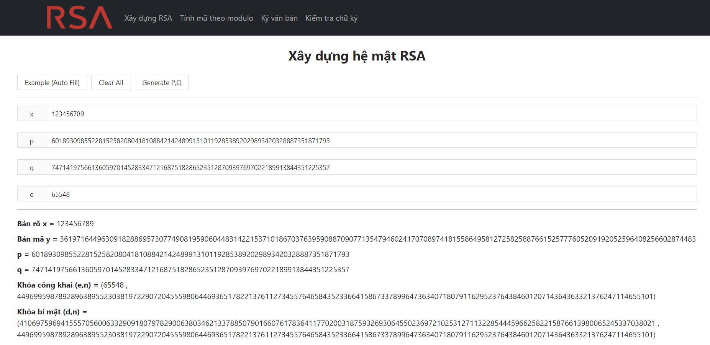
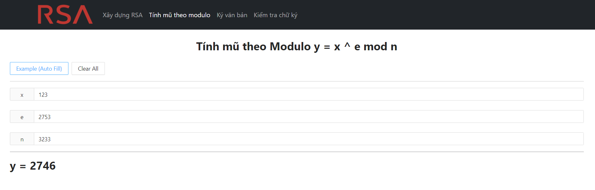
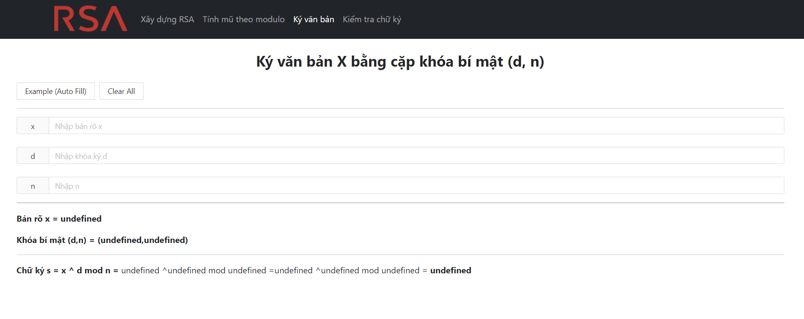
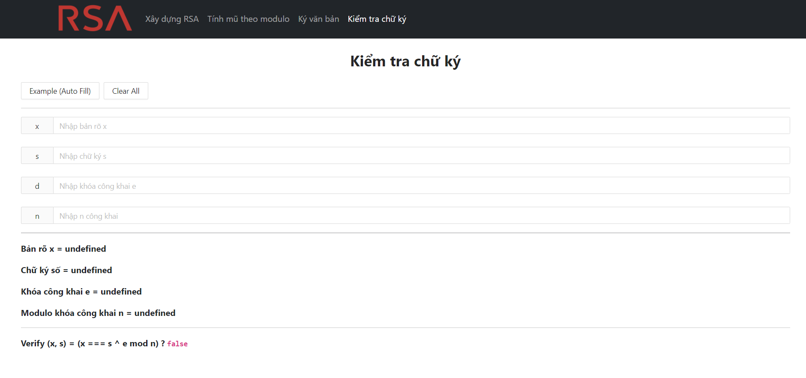

# Nhập môn an toàn thông tin ⚠

## Cách cài đặt

- Cài đặt yarn [tại đây](https://yarnpkg.com/)
- Cài đặt các dependency, chạy lệnh

  ```
  yarn install
  ```

- Khởi chạy
  ```
  yarn start
  ```
- Truy cập vào đường dẫn http://localhost:3000/

## Demo

### Xây dựng hệ mật RSA



### Tính mũ theo modulo



### Ký văn bản bằng hệ mật RSA



### Kiểm tra chữ ký


